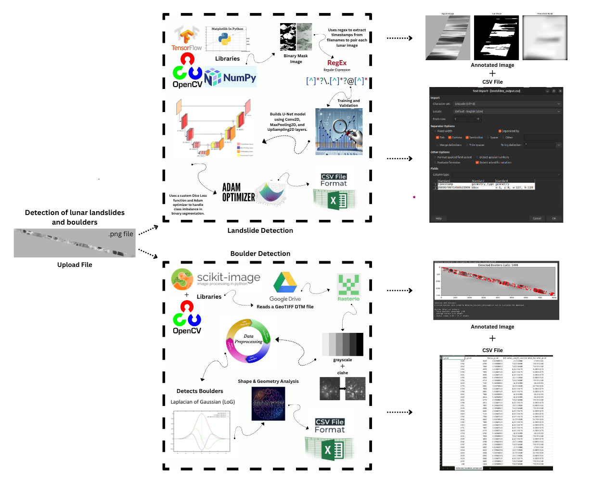

#  NovaDetect: Lunar Landslide & Boulder Detection using Chandrayaan Imagery



---

##  Overview

**NovaDetect** is an end-to-end AI-powered pipeline that detects **landslides** and **boulders** on the Moon using images from **Chandrayaan-1 and 2** missions. The solution leverages:

-  Deep learning (U-Net CNN) for **landslide segmentation**
-  Terrain-aware computer vision with **LoG + DTM fusion** for **boulder detection**

Our aim is to automate the detection process across diverse terrains on the Moon with **high precision**, **scalability**, and **geospatial interpretability**.

---

##  Core Features

###  Landslide Detection (U-Net CNN)
- Trained on **TMC images + manually annotated masks**
- Learns spatial patterns of landslides (irrespective of lighting/slope)
- Outputs: 
  - Annotated landslide masks
  - CSV with bounding box coordinates & timestamps

###  Boulder Detection (LoG + DTM Fusion)
- Uses **blob detection** + **DTM-based elevation filtering**
- Extracts:
  - Location (X, Y)
  - Estimated **length, diameter**
  - Elevation and slope features (if DTM is used)
- Outputs:
  - Annotated images with overlays
  - CSV of boulder statistics

---

##  Key Innovations

- **AI-Terrain Fusion**: First to combine U-Net segmentation with DTM geometry for lunar surface analysis
- **Smart Data Alignment**: Regex-based timestamp matching ensures accurate image-mask pairing
- **DTM-Enhanced Filtering**: Uses slope, elevation, and local variance to eliminate false positives and prioritize geologically significant boulders
- **Universal Scalability**: Location-independent system works across all Chandrayaan-covered lunar regions

---

##  Technologies Used

| Category          | Tools & Libraries                                  |
|-------------------|---------------------------------------------------|
| Language          | Python                                            |
| Deep Learning     | TensorFlow, Keras                                 |
| Image Processing  | OpenCV, scikit-image, Matplotlib                  |
| Data Handling     | NumPy, Pandas                                     |
| DTM Handling      | Rasterio (optional, for elevation data)           |
| GIS Tools         | QGIS (for visualization & validation - optional)  |

---

##  Output Files

| Type        | Description                                           |
|-------------|-------------------------------------------------------|
| `.png`      | Annotated predictions (landslides/boulders)           |
| `.csv`      | Geometric & statistical info of detected features     |
| `.h5`       | Trained U-Net model for landslide detection           |

---

##  Sample Outputs

###  Landslide Detection:
- Mask overlay showing segmented landslide regions
- CSV: timestamp, bounding box coordinates

###  Boulder Detection:
- Image with red/cyan circular overlays for boulders
- CSV: X, Y, radius, estimated length/diameter, elevation info (if DTM used)

---

##  How to Run

1. **Clone the repository**
```bash
git clone https://github.com/yourusername/NovaDetect.git
cd NovaDetect
```

2. **Install Dependencies**
```bash
pip install -r requirements.txt
```

3. **Landslide Detection**
```bash
python train_landslide_model.py     # Train U-Net model
python predict_landslides.py image.png   # Predict on new image
```

4. **Boulder Detection (with/without DTM)**
```bash
# Run in Google Colab (recommended)
# Upload image and optionally mount Google Drive for DTM
```

---

##  Dataset Sources

- **TMC (Terrain Mapping Camera)** – Chandrayaan-1 & 2
- **OHRC (Optical High-Resolution Camera)** – Chandrayaan-2
- **DTM** – Derived from Chandrayaan stereo imagery

---

##  Team Members

- **Harish Suresh**
- **Pooja Shree S** 
- **Arjun K**
- **Shreya B**

---

##  Research Impact

This pipeline advances lunar geological research by providing automated, high-precision detection of critical surface features with unprecedented accuracy and scope. The fusion of AI with planetary data opens new possibilities for understanding lunar surface dynamics and geological processes.

---

*Built with ❤️ for lunar exploration and planetary science*
